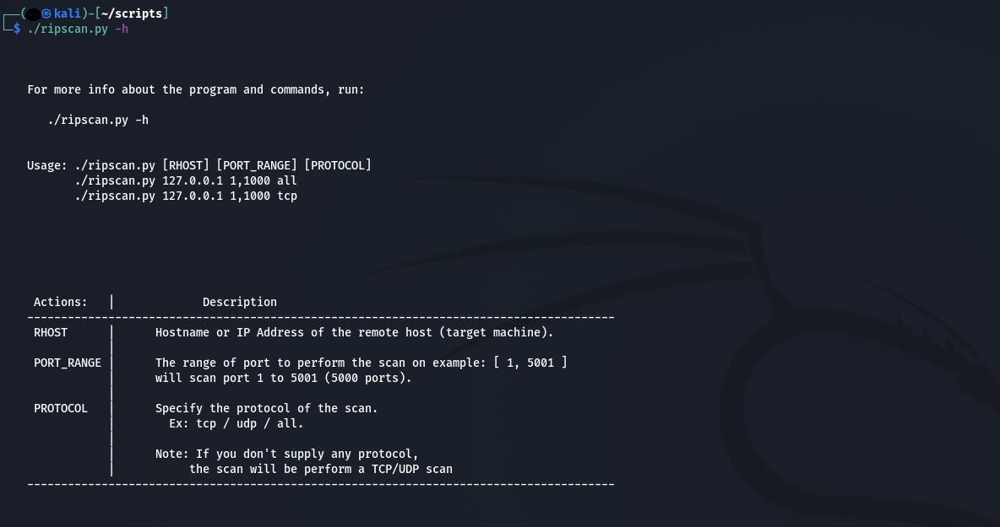
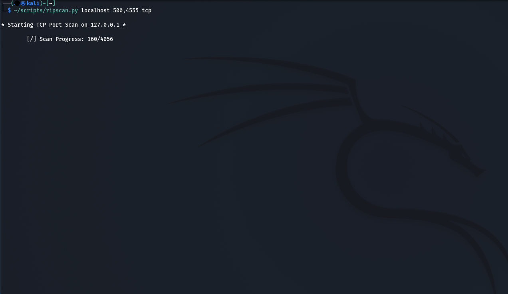
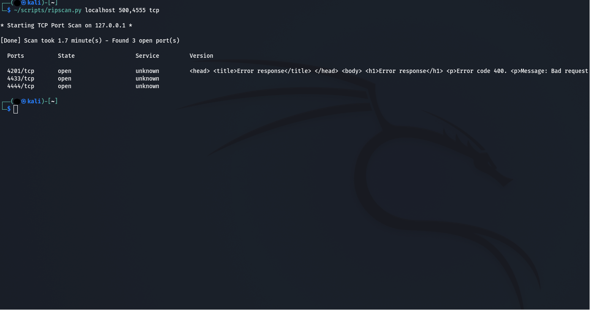

# ripscan

## Description

Ripscan is a basic TCP/UDP Port scanner, made for educational purpose only (mine and yours). 
It's my attempt at reproducing [really basic] nmap functionalities and getting my foot into
the realm of  cybersecurity tools, used for Pentesting, Bug Bounty and/or CTFs.

## Usage

- Get Help:  
  &emsp;`./ripscan.py -h`  
- Launch a TCP scan on localhost from port 1 to 5000 :  
  &emsp;`./ripscan.py localhost 1,5000 tcp`  
- Launch a UDP scan on 127.0.0.1 from port 433 to 455 :  
  &emsp;`./ripscan.py 127.0.0.1 433,455 udp`  
- Launch a TCP/UDP scan on localhost on port 53 :  
  &emsp;`./ripscan.py localhost 53 all`  or  &emsp;`./ripscan.py localhost 53`  

## Examples

   
   
Here I basically started 2 netcat listener on port 4433 and 4444 and a HTTP server from python's SimpleHTTPServer module. 
Our netcat listenners are giving us no addtional info on the open ports. 
However, the HTTP server responded with a broken HTML with error code 400, which is enough to know that port 4201 is probably running a web server. 
  

## Functionalities

This scanner only supports scans on a single host for the moment,
but will eventually permits batch scanning.

You can provide a Hostname, which will be resolved into an IPV4 Address, if it is valid 
or simply provide a valid IPV4 Address.  
While scanning, ripscan will try to gather information on the default service running on a specific port
and will send probes to retrieve a service banner, if any is available.

Since ripscan allocates the chosen port range across multiple processes, it is unlikely going to test ports in consecutive order, which might help avoiding port scan filtering.
